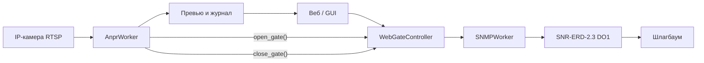
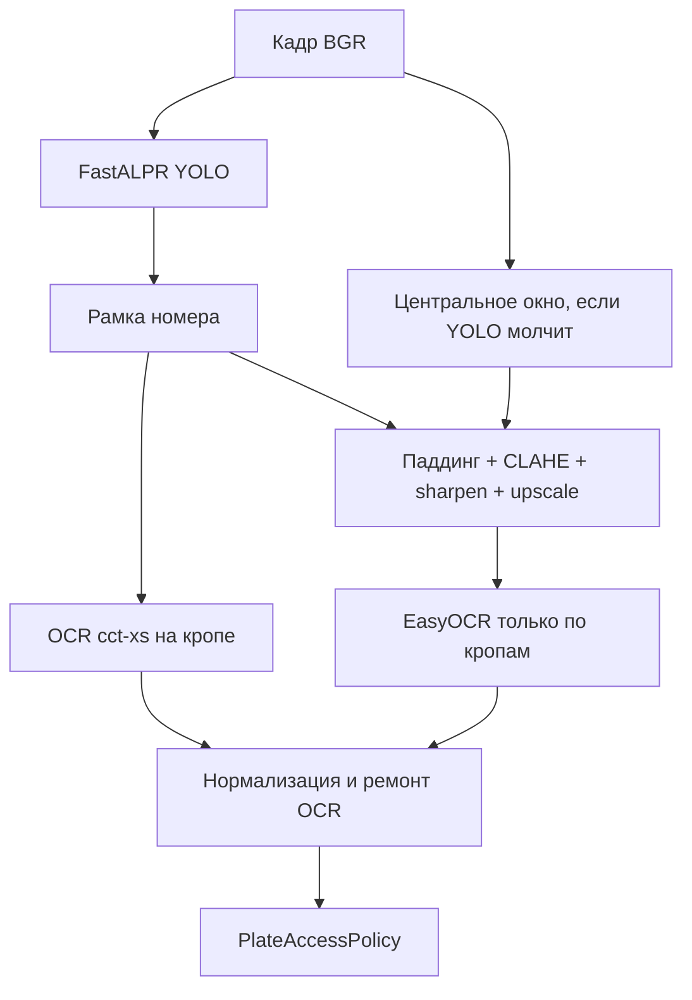
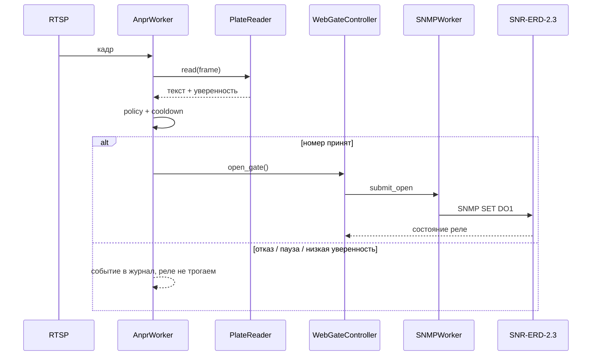

# Архитектура Gate Control (ветка `feature/anpr-rtsp`)

Система поднимает шлагбаум двумя путями: вручную (кнопка в GUI/вебе) и автоматически, когда на кадре с RTSP распознан автомобильный номер. Команда на железо в обоих случаях одна и та же — SNMP SET на реле SNR-ERD-2.3.

## Общая схема

Запуск круглосуточного контура: `python web_server.py` (FastAPI на `web_host`/`web_port`). Десктопный `python main.py` управляет только шлагбаумом, без камеры.

## Слои

| Слой | Файлы | Роль |
|------|--------|------|
| Конфиг | `config.json`, `config.py` | IP камеры, SNMP, пороги ANPR, белый список |
| Камера и аналитика | `services/anpr_worker.py`, `services/plate_reader.py`, `services/plate_finder.py`, `services/plate.py`, `services/preprocess.py`, `services/roi.py`, `services/stream_probe.py`, `services/motion.py` | RTSP → кадр → текст номера → решение |
| Шлагбаум | `services/snmp_worker.py`, `services/snmp_gate.py` | Фоновый asyncio-поток, SNMP GET/SET |
| Веб | `web/app.py`, `web/controllers/web_gate_controller.py`, `web/static/index.html` | Кнопки, статус, превью кадра |
| GUI | `ui/main_window.py`, `controllers/gate_controller.py` | То же SNMP, без ANPR |

## Как разбирается кадр

`AnprWorker` крутится в отдельном потоке, чтобы не блокировать веб-сервер. URL потока можно сменить на лету: `POST /api/anpr/stream` с `{ "url": "rtsp://...", "flip": true }` — модели не перезагружаются, открывается новый захват.

1. **Захват.** OpenCV читает RTSP. При подключении ~1.5 с замеряются разрешение и fps (`services/stream_probe.py`), подбираются интервал анализа и ширина кадра (`anpr_auto_tune`).
2. **Не весь поток.** Между ключевыми кадрами идёт только `grab()` (сброс буфера без decode). `retrieve()` + ALPR — по таймеру (light ~0.8 с, heavy ~2.2 с). Превью обновляется реже fps камеры (light ~2.5 с, heavy ~3.5 с). Если `anpr_motion_detect: true`, ALPR пропускается при малом изменении кадра (mean diff &lt; `anpr_motion_threshold`); без распознанного номера повтор каждые `anpr_motion_retry_sec` с.
3. **Подготовка кадра.** Зеркало, уменьшение до `resize_width` через `INTER_AREA`. Если `anpr_roi_enabled: true`, для ALPR вырезается зона `anpr_roi` (нормализованные доли 0..1); превью показывает рамку ROI зелёным.
4. **Превью.** JPEG ~640 px на `/api/anpr/snapshot`. ROI доступна в `GET /api/status` → `anpr.roi`.

### Два движка распознавания (`PlateReader`)

На одном кадре работают оба, результаты сливаются. Приоритет у строк, которые удалось привести к российскому ГРЗ.

**FastALPR** (ONNX, CPU) — основной путь для настоящей машины: детектор `yolo-v9-t-384-license-plate-end2end`, OCR `cct-xs-v2-global-model`.

**EasyOCR** — опционально (`anpr_easyocr_enabled`). По умолчанию выключен: грузит torch и нестабилен на CPU.

**Запасной путь OpenCV** (`anpr_cv_fallback`, по умолчанию включён), если YOLO не нашёл пластину на машине:

1. Приоритетные зоны: верхний центр (стенд/шлагбаум), центральная полоса, весь кадр.
2. Маски для поиска рамки (только детекция, OCR — по цветному кропу):
   - порог / адаптивный порог на сером;
   - **CLAHE + Otsu** (ч/б, как в Nomeroff);
   - локальный адаптивный порог, Canny, Sobel по вертикали/горизонтали;
   - HSV «белый», black-hat для светлой пластины.
3. Контуры → оценка (solidity, aspect ratio, quad-бонус) → **перспективное выравнивание** (`warp_quad_plate`).
4. Запасные окна кадра: широкий центр (номер в руках) + верхний центр (стенд).
5. FastALPR на кропе; склейка фрагментов `C108EC` + `154` → `С108ЕС154`.
6. OCR fast-plate-ocr только по кропам, не по полному кадру.

Модели качаются при первом запуске (Hugging Face), нужен интернет.

### Нормализация номера (`services/plate.py`)

Сырой текст приводится к канону:

- верхний регистр, без пробелов и `RUS`;
- латиница-двойники → кириллица ГРЗ (`A→А`, `H→Н`, `M→М` …);
- формат: `буква + 3 цифры + 2 буквы` и опционально регион 2–3 цифры (`А182МН` или `А182МН77`);
- типичные ошибки OCR: `Z→2`, `II→Н` и разбор по позициям символов.

Дальше `PlateAccessPolicy`:

- порог уверенности `anpr_min_confidence`;
- опционально только белый список `anpr_allowed_plates`;
- флаг `anpr_open_on_detect` — можно только логировать, не открывая.

Если номер не проходит проверку, шлагбаум не трогают, факт пишется в журнал.

## Связка со шлагбаумом

Автооткрытие вызывает **тот же** `WebGateController.open_gate()`, что и кнопка «Поднять». Дальше:

1. `SNMPWorker` в своём потоке с постоянным asyncio-loop выполняет команду.
2. `SNMPGate` пишет OID `oid_do1` на ERD:
   - `do1_mode: hold` — SET `0` поднять, SET `1` опустить;
   - `do1_mode: pulse` — SET `2` (импульс).
3. Кулдаун SNMP (`command_cooldown_sec` / `pulse_cooldown_sec`) не даёт спамить реле.
4. Отдельный кулдаун ANPR (`anpr_open_cooldown_sec`, сейчас 20 с) не открывает шлагбаум повторно, пока тот же номер стоит в кадре.

### Автоопускание

Если `anpr_auto_close: true`, `AnprWorker` отслеживает отсутствие номера в кадре (нет осмысленного OCR/YOLO-чтения). После `anpr_close_after_sec` секунд подряд без номера вызывается **тот же** `WebGateController.close_gate()`, что и кнопка «Опустить»:

- `do1_mode: hold` — SNMP SET `1` (DO1 опустить);
- `do1_mode: pulse` — SNMP SET `2` (импульс, как при открытии).

Пока действует кулдаун после открытия (`anpr_open_cooldown_sec`), таймер опускания сбрасывается — шлагбаум не опускается сразу после автооткрытия. Команда опускания отправляется один раз на «серию» пустых кадров; повтор — только после появления номера и нового исчезновения. `WebGateController` дополнительно пропускает SET, если DO1 уже в целевом состоянии (режим hold).

Ручное управление с веба (`POST /api/open`, `/api/close`) идёт в тот же контроллер, минуя камеру.

## Веб-статус

`GET /api/status` отдаёт и реле, и ANPR: камера подключена/нет, последний номер, уверенность, причина (открыт / низкая уверенность / нет в списке). Журнал на странице подтягивает события воркера.

## Что важно для продакшена

- Нужен постоянный RTSP, не одноразовая ссылка с `wmsAuthSign` на 60 минут.
- Детектор пластины рассчитан на номер **на машине**, анфас, без сильного смаза.
- Широкий угол «вся комната» даёт мелкий номер и ложные срабатывания EasyOCR.
- Для въезда лучше камера на полосу + белый список `anpr_whitelist_only: true`.
- Десктопный GUI шлагбаум открывает, аналитику кадра не запускает.

## Источники (что взяли и что сознательно не взяли)

| Источник | Оценка | Что применили |
|----------|--------|----------------|
| [Habr 432444 Nomeroff](https://habr.com/ru/articles/432444/) | Полезна как схема пайплайна: зона номера → выровнять → OCR → шаблон страны. Tesseract слабый; Mask R-CNN / TensorFlow на CPU для нас тяжелы. | Паддинг bbox перед OCR, ремонт по шаблону ГРЗ (уже был). Nomeroff/TF не подключаем. |
| [Habr 594401 скорость](https://habr.com/ru/articles/594401/) | Самая полезная: YOLO bbox ≫ сегментация маски; ресайз `INTER_AREA`; OCR только после кропа; бинарная маска → контур → выравнивание. | EasyOCR больше не гоняет полный HD. Ресайз кадра через `INTER_AREA`. Ч/б CLAHE+Otsu для поиска рамки. |
| [nomerogram.ru](https://www.nomerogram.ru/) | Сервис проверки авто по ГРЗ (фото с объявлений), **не** OCR-движок. Под капотом — экосистема Nomeroff Net. | Не интегрируем API. Берём идеи Nomeroff: контур, перспектива, шаблон ГРЗ. |
| [Habr 965706 CV с нуля](https://habr.com/ru/articles/965706/) | Базовые фильтры (sharpen 0/-1/0/-1/5, контраст). Не про номера как таковые. | CLAHE + sharpen + upscale **на кропе**, не на всём кадре. |
| [recog.ru / iANPR](https://recog.ru/) | UX: поле адреса камеры, превью, отдельный поток захвата. Сам SDK платный C++/WinForms. | Поле RTSP + «Подключить» без рестарта процесса. iANPR не берём. |
| [smeyanoff/car-number-detection](https://github.com/smeyanoff/car-number-detection) | YOLO + LPRNet — та же идея, что FastALPR; bbox номера внутри bbox машины. | Стек не дублируем; горизонтальные градиенты для рамки. |
| [OpenCV Face Recognition](https://github.com/Mjrovai/OpenCV-Face-Recognition), [FaceNet](https://dev.to/edgaras/face-recognition-with-facenet-ha8), [CompreFace](https://github.com/exadel-inc/CompreFace) | Распознавание **лиц** (Haar/LBPH, эмбеддинги). К ГРЗ не применимо. | Не используем. |
