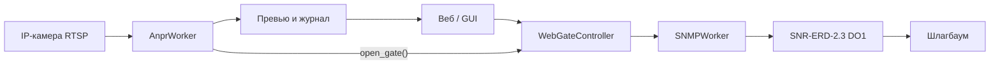
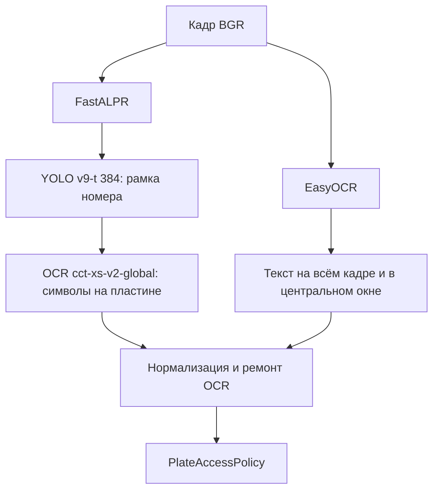
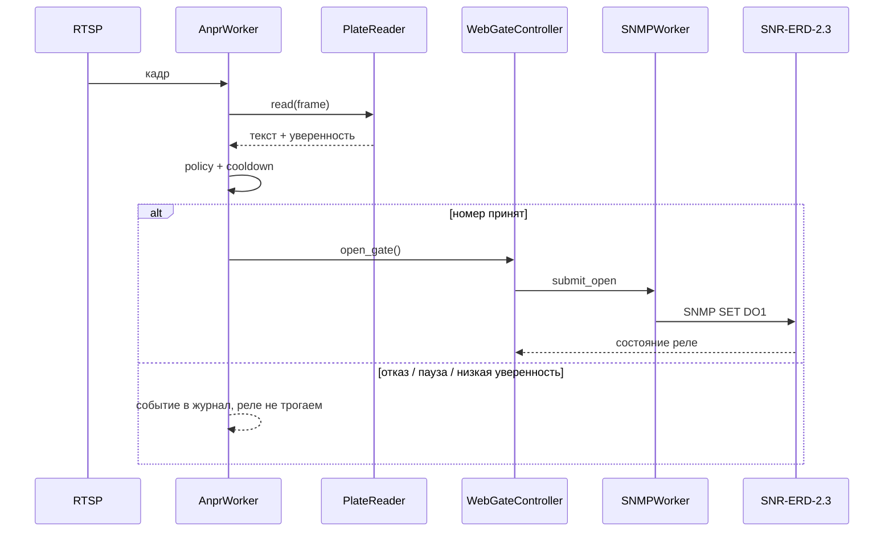

# Архитектура Gate Control (ветка `feature/anpr-rtsp`)

Система поднимает шлагбаум двумя путями: вручную (кнопка в GUI/вебе) и автоматически, когда на кадре с RTSP распознан автомобильный номер. Команда на железо в обоих случаях одна и та же — SNMP SET на реле SNR-ERD-2.3.

## Общая схема

Запуск круглосуточного контура: `python web_server.py` (FastAPI на `web_host`/`web_port`). Десктопный `python main.py` управляет только шлагбаумом, без камеры.

## Слои

| Слой | Файлы | Роль |
|------|--------|------|
| Конфиг | `config.json`, `config.py` | IP камеры, SNMP, пороги ANPR, белый список |
| Камера и аналитика | `services/anpr_worker.py`, `services/plate_reader.py`, `services/plate.py` | RTSP → кадр → текст номера → решение |
| Шлагбаум | `services/snmp_worker.py`, `services/snmp_gate.py` | Фоновый asyncio-поток, SNMP GET/SET |
| Веб | `web/app.py`, `web/controllers/web_gate_controller.py`, `web/static/index.html` | Кнопки, статус, превью кадра |
| GUI | `ui/main_window.py`, `controllers/gate_controller.py` | То же SNMP, без ANPR |

## Как разбирается кадр

`AnprWorker` крутится в отдельном потоке, чтобы не блокировать веб-сервер.

1. **Захват.** OpenCV (`cv2.VideoCapture`, FFmpeg) читает RTSP. Транспорт по умолчанию TCP. При обрыве — переподключение с backoff.
2. **Не каждый кадр.** Берётся кадр раз в `anpr_frame_interval_sec` (сейчас 0.5 с). Лишние кадры из буфера сбрасываются через `grab()`, чтобы не анализировать устаревшую картинку.
3. **Подготовка.** Опционально горизонтальное зеркало (`anpr_flip_horizontal`) — у тестовой камеры картинка была зеркальной. Затем уменьшение ширины до `anpr_resize_width`.
4. **Превью.** Тот же кадр жмётся в JPEG ~640 px и отдаётся на `/api/anpr/snapshot`.

### Два движка распознавания (`PlateReader`)

На одном кадре работают оба, результаты сливаются. Приоритет у строк, которые удалось привести к российскому ГРЗ.

**FastALPR** (ONNX, CPU) — основной путь для настоящей машины:

- детектор `yolo-v9-t-384-license-plate-end2end` ищет прямоугольник номера на авто;
- OCR `cct-xs-v2-global-model` читает символы внутри рамки.

**EasyOCR** (`ru` + `en`, CPU) — запасной путь, если детектор пластины молчит: бумажная табличка, сильный ракурс, номер не похож на «классическую» пластину. Медленнее и чаще ловит посторонний текст в комнате.

Модели качаются при первом запуске (Hugging Face / кэш EasyOCR), нужен интернет.

### Нормализация номера (`services/plate.py`)

Сырой текст приводится к канону:

- верхний регистр, без пробелов и `RUS`;
- латиница-двойники → кириллица ГРЗ (`A→А`, `H→Н`, `M→М` …);
- формат: `буква + 3 цифры + 2 буквы` и опционально регион 2–3 цифры (`А182МН` или `А182МН77`);
- типичные ошибки OCR: `Z→2`, `II→Н` и разбор по позициям символов.

Дальше `PlateAccessPolicy`:

- порог уверенности `anpr_min_confidence`;
- опционально только белый список `anpr_allowed_plates`;
- флаг `anpr_open_on_detect` — можно только логировать, не открывая.

Если номер не проходит проверку, шлагбаум не трогают, факт пишется в журнал.

## Связка со шлагбаумом

Автооткрытие вызывает **тот же** `WebGateController.open_gate()`, что и кнопка «Поднять». Дальше:

1. `SNMPWorker` в своём потоке с постоянным asyncio-loop выполняет команду.
2. `SNMPGate` пишет OID `oid_do1` на ERD:
   - `do1_mode: hold` — SET `0` поднять, SET `1` опустить;
   - `do1_mode: pulse` — SET `2` (импульс).
3. Кулдаун SNMP (`command_cooldown_sec` / `pulse_cooldown_sec`) не даёт спамить реле.
4. Отдельный кулдаун ANPR (`anpr_open_cooldown_sec`, сейчас 20 с) не открывает шлагбаум повторно, пока тот же номер стоит в кадре.

Ручное управление с веба (`POST /api/open`, `/api/close`) идёт в тот же контроллер, минуя камеру.

## Веб-статус

`GET /api/status` отдаёт и реле, и ANPR: камера подключена/нет, последний номер, уверенность, причина (открыт / низкая уверенность / нет в списке). Журнал на странице подтягивает события воркера.

## Что важно для продакшена

- Нужен постоянный RTSP, не одноразовая ссылка с `wmsAuthSign` на 60 минут.
- Детектор пластины рассчитан на номер **на машине**, анфас, без сильного смаза.
- Широкий угол «вся комната» даёт мелкий номер и ложные срабатывания EasyOCR.
- Для въезда лучше камера на полосу + белый список `anpr_whitelist_only: true`.
- Десктопный GUI шлагбаум открывает, аналитику кадра не запускает.
